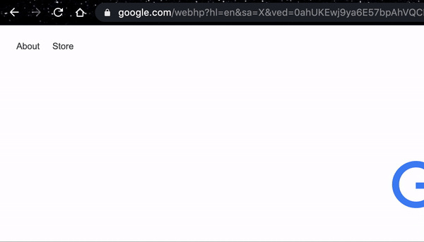
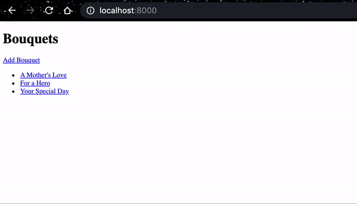
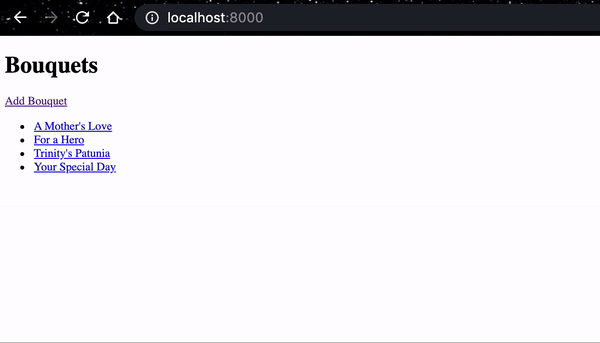
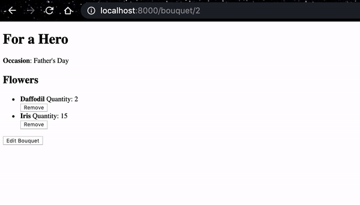
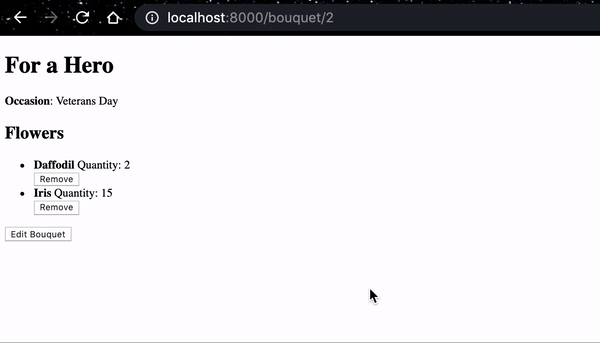

# Flower Shop Django Application

Created: 05-15-20 | Modified:
---

- [Instructions to setup project for your machine](directions/boiler-setup.md)
- [Requirements for this project](directions/requirements.md)
- [File Structure Readme's](directions/file_structure/main.md)

## Features

### View List of Bouquet
- At the root URL of the application (`/`), a list of all the bouquets are shown in alphabetical order.

---

### Adding a Bouquet
- Above the list of bouquets, there's a link to "Add a Bouquet" that takes the user to a form to add a new bouquet by providing a name and occasion. 
- When the form is submitted, the user is directed to `/` and can now see the newly added bouquet in the list.

---

### Viewing Bouquet Details
- Each bouquet on the list page has a link to view the details of the bouquet.
- When the user clicks on this link, they can view the name of the bouquet, the occasion, the names of the many flowers that make up that bouquet and the quantity of each flower needed for that bouquet.

---

### Editing a Bouquet
- When the user clicks on the button at the bottom of the bouquet details page, they are presented with a form that lets them edit only the occasion of the bouquet. 

### Deleting a Flower from a Bouquet
- When the user clicks the delete button next to each flower listed on the details page for a bouquet, the flower is then removed from that bouquet. 
- This action does not delete the flower itself, only the relationship between the flower and the bouquet

